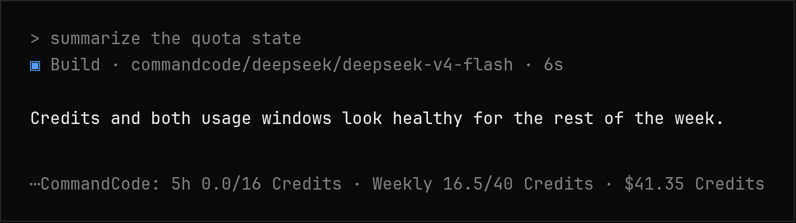
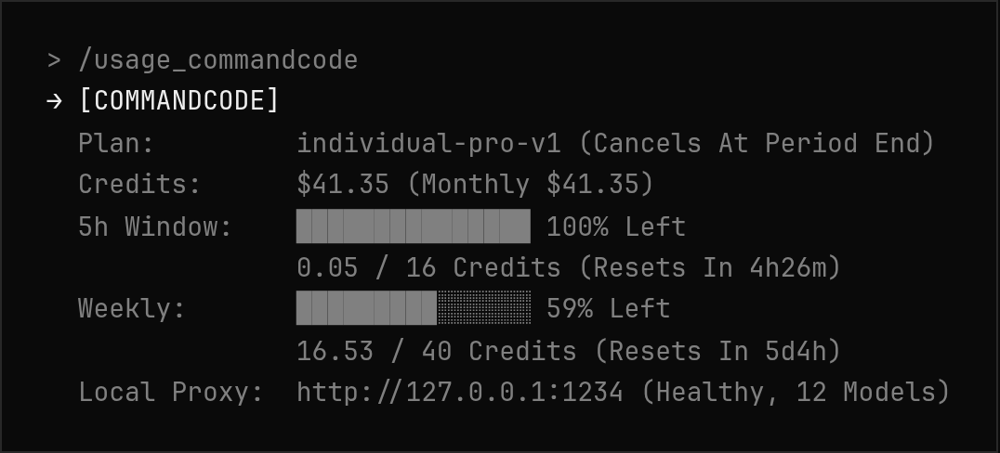

# opencode-plugin-commandcode-usage

opencode plugin that shows [CommandCode](https://commandcode.ai) credits and usage window limits, and registers CommandCode as an opencode provider (models + `/connect`).





_Screenshots show real plugin output rendered in the opencode color theme._

## Provider registration

CommandCode is not in the opencode provider catalog (models.dev). This plugin registers two providers at startup, both pointing at `https://api.commandcode.ai/provider/v1`:

- `commandcode` — OpenAI-compatible models (`gpt-*`, `deepseek/*`, `moonshotai/*`, `zai-org/*`, ...) via `@ai-sdk/openai-compatible`
- `commandcode-claude` — `claude-*` models via `@ai-sdk/anthropic` (the API requires the Anthropic Messages shape for Claude models)

The model list is fetched live from `GET /provider/v1/models` (public, no auth needed) with a small built-in fallback. Both providers authenticate with:

1. `COMMANDCODE_API_KEY` environment variable, or
2. `/connect` → "CommandCode (API Key)" / "CommandCode Claude (API Key)" (stored in `~/.local/share/opencode/auth.json`)

Usage example:

```
opencode run -m commandcode/deepseek/deepseek-v4-flash "hi"
opencode run -m commandcode-claude/claude-haiku-4-5-20251001 "hi"
```

## Usage commands

- `/usage_commandcode` — show CommandCode usage
- `/usage commandcode` (aliases: `cmd`, `cc`) — same, via the shared `/usage` command

## What it shows

- Plan (plan id, status, cancellation at period end)
- Credits: monthly + purchased + free
- 5-hour window: used / cap, percent left, reset countdown
- Weekly window: used / cap, percent left, reset countdown
- Local commandcode-proxy status (`COMMANDCODE_PROXY_URL`, default `http://127.0.0.1:1234`): health + model count

Data sources (read-only GET):

- `GET https://api.commandcode.ai/alpha/billing/credits`
- `GET https://api.commandcode.ai/alpha/billing/subscriptions`
- `GET {COMMANDCODE_PROXY_URL}/health` and `/v1/models`

## Authentication

`COMMANDCODE_API_KEY` environment variable, or `/connect` (see Provider registration).

## Notes

- Requests send `x-command-code-version: 1.32.1`. If CommandCode starts enforcing a newer minimum CLI version, bump the constant in `src/usage.ts`.
- These are internal `/alpha/` endpoints used by the CommandCode CLI itself; they may change without notice.
- API calls are retried up to 3 times (500ms/1s backoff) because `api.commandcode.ai` connectivity can be intermittent on IPv6-blackholed networks.

## Automatic footer

Every assistant response gets a one-line usage footer appended (same technique as opencode-quotas, via the `experimental.text.complete` hook). Footer data is cached for 60s so each response does not trigger an API call.

- Disable: `USAGE_FOOTER=0`
- Cache TTL: `USAGE_FOOTER_TTL_MS` (default `60000`)

The footer is stored in the message text, so it also becomes part of the LLM context on subsequent turns.

## TUI sidebar section

The plugin also ships a TUI plugin (`src/tui.ts`) that renders a live usage section in the right sidebar (next to Context/MCP/LSP), refreshed every 60s. Register it in `tui.json`:

```json
{
  "plugin": [
    "file:///absolute/path/to/opencode-plugin-<provider>-usage/src/tui.ts"
  ]
}
```

It follows the host-solid pattern used by oh-my-openagent (dynamic `import("@opentui/solid")` + manual node materialization), so it shares the TUI process's renderer instance. Requires the same API key environment variable as the server plugin.
